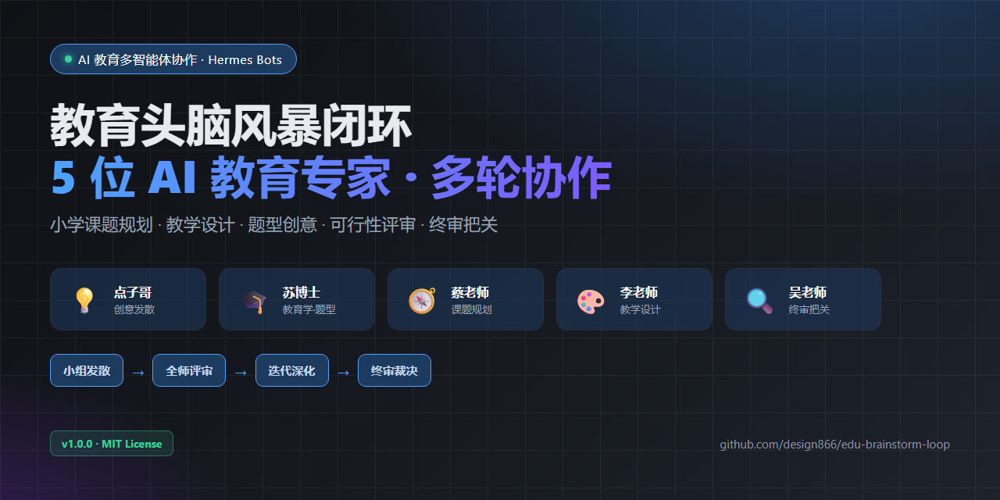

# 🧑‍🏫 edu-brainstorm-loop · 教育头脑风暴闭环（5 专家机器人协作）



小学教育课题/教学设计的**多机器人头脑风暴工作流**：5 位 AI 教育专家按「小组发散 → 全师评审 → 迭代深化 → 终审把关」闭环协作，产出有理论根基、可落地的创意方案。

## ✨ 特性

- **5 位教育专家机器人**，角色互补：
  - 💡 点子哥（edu-brains）：直觉创意发散引擎
  - 🎓 苏博士（edu-pedagogy）：教育学博士，教育理论 + 题型创意设计
  - 🧭 蔡老师（edu-planner）：课题规划，可行性评审
  - 🎨 李老师（edu-designer）：教学设计，课堂落地评审
  - 🔍 评课吴老师（edu-reviewer）：质量评审 + 终审总把关
- **多轮闭环流程**：创意小组先内部激烈碰撞（点子哥 × 苏博士）→ 全师评审可行性 → 小组迭代深化 → 吴老师终审裁决
- **一键执行**：`bash brainstorm-session.sh "课题"` 自动跑完整闭环
- **教育学根基**：每个点子都有教育理论依据（皮亚杰/布鲁纳/维果茨基/建构主义）

## 🚀 安装（Hermes 用户）

> ⚠️ **前置依赖**：安装后需 ①建立 5 个专家机器人 ②安装 OpenMAIC 平台，本流程才能运行和交付。

```bash
# 1. 创建 5 个专家机器人（Hermes profile）
hermes profile create edu-brains    --clone --description "小学教育头脑风暴主持人点子哥"
hermes profile create edu-pedagogy  --clone --description "教育学博士苏博士：教育理论+题型创意"
hermes profile create edu-planner   --clone --description "小学课题规划专家蔡老师"
hermes profile create edu-designer  --clone --description "小学教学设计专家李老师"
hermes profile create edu-reviewer  --clone --description "小学课堂诊断专家评课吴老师"

# 2. 将 profiles/*-SOUL.md 复制到对应 profile 的 SOUL.md
# 3. 将 SKILL.md 放入 Hermes skills 目录（如 ai/edu/edu-brainstorm-loop/）
# 4. 将 scripts/brainstorm-session.sh 放入技能目录
# 5. 安装 OpenMAIC（互动课堂平台，负责最终交付与语音）：
#    git clone https://github.com/THU-MAIC/OpenMAIC && cd OpenMAIC && pnpm install && pnpm dev
```

## 📖 用法

```bash
bash brainstorm-session.sh "小学二年级《认识钟表》的创意教学活动"
```

输出到 `%LOCALAPPDATA%\Temp\brainstorm\round*.txt`，完成后人工汇总成头脑风暴纪要。

## 📦 目录结构

```
SKILL/
├── SKILL.md                      # 技能定义（Hermes/Claude Code 技能格式）
├── scripts/
│   └── brainstorm-session.sh     # 四轮闭环执行脚本
├── profiles/                     # 5 个机器人角色定义（SOUL.md 合集）
│   ├── edu-brains-SOUL.md
│   ├── edu-pedagogy-SOUL.md
│   ├── edu-planner-SOUL.md
│   ├── edu-designer-SOUL.md
│   └── edu-reviewer-SOUL.md
├── 角色定义总览.md                # 角色速览 + 使用场景
├── README.md
└── LICENSE
```

## 🔧 技术说明

- 平台：Hermes Agent（Windows 实测），依赖 `hermes -p <profile> chat` 命令
- 模型：默认火山方舟 Agent Plan；可切换任意 LLM provider（见 SKILL.md 配额陷阱）
- 一次闭环 = 6 次 LLM 调用（轮0×2 + 轮2×3 + 轮3×2 + 轮4×1）

## 🧪 实战案例：《二年级数学知识扩展》头脑风暴

5 位专家机器人的真实协作产出（完整纪要）：

### 轮 0 · 创意小组碰撞（点子哥 × 苏博士）

**点子哥**发散 10 个点子，三维覆盖：
- 题型创意：长度侦探所 / 谁的长度错了 / 估测配对考 / 身体尺密码
- 活动体验：教室厘米地图 / 寻宝坐标
- 跨学科：跳远×体育 / 树叶测量×科学 / 我的1米尺×美术 / 测量童话×语文

**苏博士**用教育理论诊断深化（皮亚杰/布鲁纳/认知负荷）：
> "二年级=具体运算期，抽象推理必须挂在具体操作上——动手不是点缀，是认知必需品"
- 改造：⑧降级为 100 格纸条累加（除法未学）；⑨降级长度路径图（比例尺是四年级）；⑩降级一维寻宝
- 补充理论创意：断尺小侦探 / 单位法庭 / 估测偏差银行 / 长度排行榜 / 单位换装秀

### 轮 2 · 全师评审
| 评审官 | 关键结论 |
|---|---|
| 李老师（落地） | ✅ 直接可上 9 个；给了 40 分钟主线组合（导入→探究→建模→巩固→收束） |
| 蔡老师（可行性） | ✅ 逐条评审完成 |
| 吴老师（质量） | 最弱⑧弃用；最值得保留 = 断尺小侦探 + 估测偏差银行 |

### 轮 3 · 小组迭代 → 3 个深化方案
- **A 身体尺探秘→统一单位**（推理+量感）：拃历史→拃量课桌→冲突→认识厘米尺→找错题
- **B 寻宝坐标·量感游戏**（量感+几何直观）：估测配对→线索先估→实测寻宝→星级复盘
- **C 我的1米尺·建构应用**（几何直观+量感进阶）：拼1米尺→量教室→大尺度体验
- 苏博士为每方案补理论根基 + 题型设计 + 评价要点 + 风险

### 轮 4 · 吴老师终审
> **⚠️ 有条件通过** — 四维全达标。关键条件：实施顺序必须 **A→C→B**（B 的"3米/2米"依赖 C 先建立米概念）

## 📄 许可证

MIT License
